# Managing backend with Azure Kubernetes Service (AKS)

## Key Takeaway

There are 2 features for the developers and operations team to consider as key takeaways from this demo -

 1. **Azure Dev Spaces** - Azure Kubernetes Service (AKS) delivers a fully managed Kubernetes based orchestration service. It provides auto-patching, auto-scaling and updates support which enables you to use the full breadth of the Kubernetes ecosystem. When doing development, it also supports AKS Dev Spaces offering which provides a fast inner loop development experience that's integrated across both Azure and Visual Studio development tools when building Kubernetes based microservice applications.
 1. **Virtual Nodes** - A first-of-its-kind serverless computing option with AKS enables you to provision and scale your Kubernetes based apps more efficiently. Virtual Node enables you to elastically provision additional nodes inside your Kubernetes clusters in just seconds. This gives you the flexibility and the portability of containers while also ensuring that you pay only for the compute resources that you actually need and use.

 # Before you begin

1. **Visual Studio 2019 Preview 1** – .NET Development workloads installed which can be downloaded from <a href="https://visualstudio.microsoft.com/vs/preview/" target="blank">here</a>

1. **.NET Core 3.0 Preview 1 SDK** - You can install it from <a href="https://github.com/dotnet/core-sdk " target="_blank">here</a>

1. You need <a href = "https://visualstudio.github.com" target="_blank">GitHub extension for Visual Studio</a>

1. Follow the instructions provided in this link to set up Backend on AKS:
   https://github.com/Microsoft/TailwindTraders-Backend

1. Follow the instructions provided in this link to set up Website on Azure Web App: 
   https://github.com/Microsoft/TailwindTraders-Website 

 Let us explore Azure Kubernetes Service to demonstrate how you will be able to take advantage of the Dev Spaces, capable to get a great inner loop development experience with Kubernetes on Azure, and then save money using our new Virtual Node service.

 ## Walkthrough: Azure Dev Spaces

 1. Go to **TailwindTraders** Website and navigate to Microwave under Home Appliances. As a developer for Tailwind Traders, imagine that you have been tasked to fix a bug. If you look at the website, notice the circles near the product. This should actually be showing information on whether this product is in stock and where it can be picked up in the store. But obviously, something is not working. That information is not visible as of now. 

    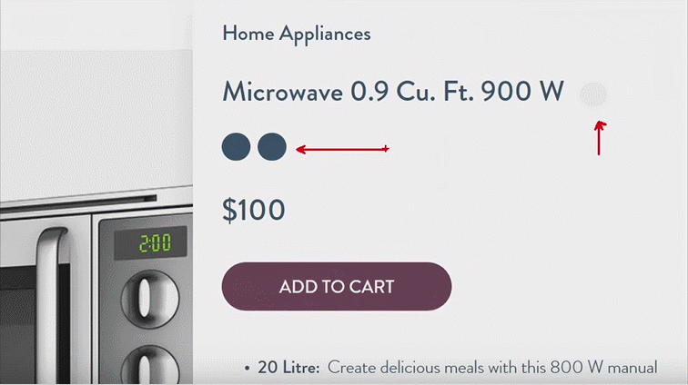

1. Back-end services are hosted entirely on the cloud running as microservices, as containers in Kubernetes. To know more about the structure, open the solution **Tailwind.Traders.Backend** in Visual Studio 2019.

    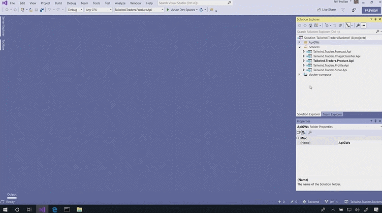

1. In your **Azure portal**, navigate to the AKS cluster and notice the **Upgrade** and **Scale** tabs under the **Settings** section. When you host containers on AKS you do not have to install or run anything on any VMs. Since you are using Azure Kubernetes Service, this gives you Kubernetes right out of the gate so you can get started and start publishing our code to it. You have everything that you need to get started. You can upgrade and choose the version of Kubernetes that you are using in the **Upgrade** tab, and control the scale very easily to add more cores, memory in the **Scale** tab.

    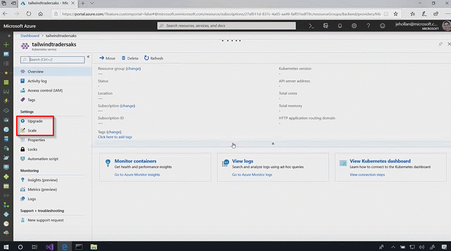

1. Click on the **Insights** tab under the **Monitoring** section. Azure Kubernetes Service is looking at all of the logs and metrics in real time and giving you insights into the health of the cluster. There is nothing here in these charts that make you think that there's a problem here with CPU or memory. Click on the **Containers** tab. So you keep drilling down to try to find this bug.

    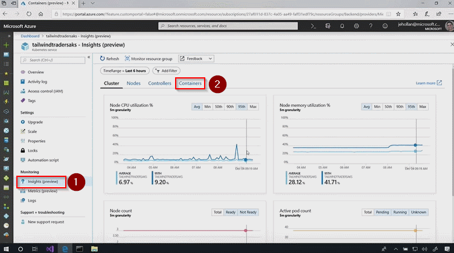

1. You can drill down deeper and see the individual containers and services that are running within your Kubernetes cluster. There are over 60 different containers that are powering your service together and here you get a real-time view of all those things. You can see that 60 containers running in Kubernetes.

    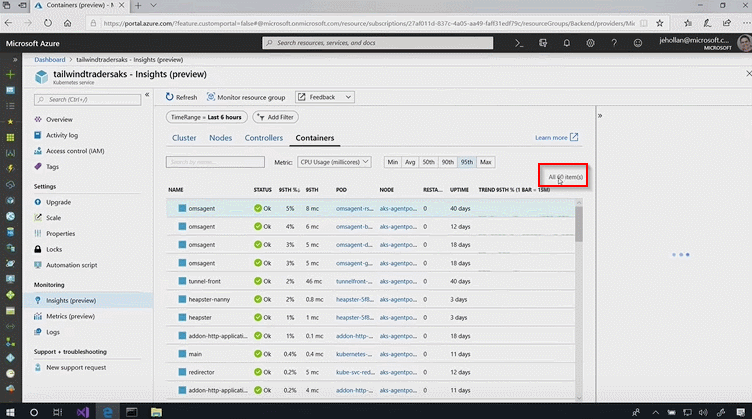

1. Search for container called **localinventory**. Click **View container logs** to drill into the logs and see if there are any clues.

    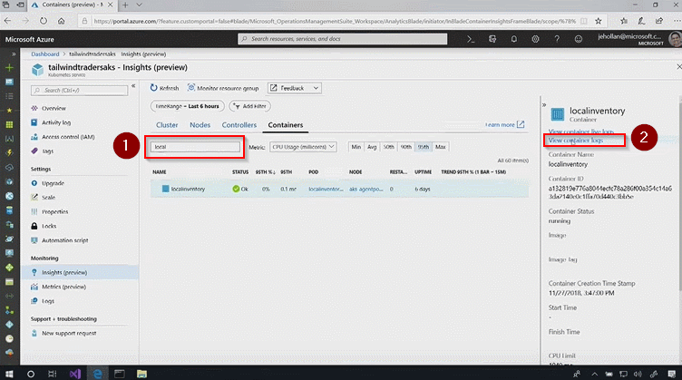

1. Another huge value-add Azure is providing is that you don't just get the logs straight from Kubernetes, it has indexed all of them for you. These are all searchable so that you can find the root cause quickly. Here you can actually see that there is an exception being thrown in ***ProductController.cs*** inside a container.  

    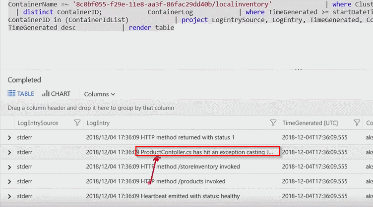

1. Switch to Visual Studio 2019 and navigate to file ***Tailwind.Traders.Product.Api>Controllers>ProductController.cs*** and set a breakpoint as shown and run this code.

    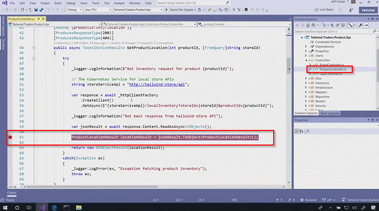

1. But even something that simple can actually be a little bit complex when running on Kubernetes. If you check out the URL here, it is not a .com address. If you try to call this URL on your machine, your computer is going to say that it does not know the IP for this service. You don't know where this is because this actually maps to another service, to one of those other containers running inside of Kubernetes. As a developer when you are using Kubernetes does that mean that now you have to take all of those 60 containers, all of Kubernetes and run them on your underpowered machine to debug? And, that is what exciting here about AKS because it actually comes with an inbuilt feature called **Dev Spaces**.

    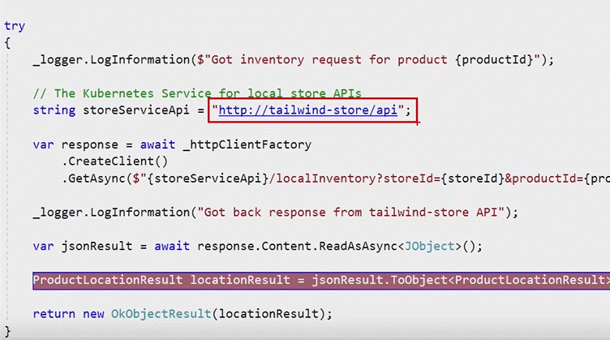

1. Right click on ***Tailwind.Traders.Product.Api*** project and click on Properties.

     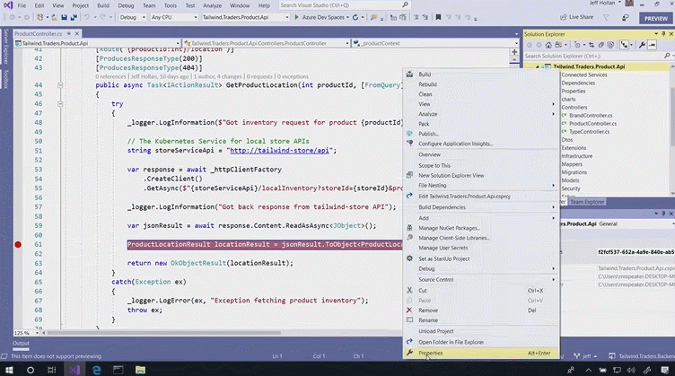

1. Navigate to **Debug** tab. What Dev Spaces allows you to do is debug and test and code locally and power that development experience by the cloud, using a personalized Dev Space.

    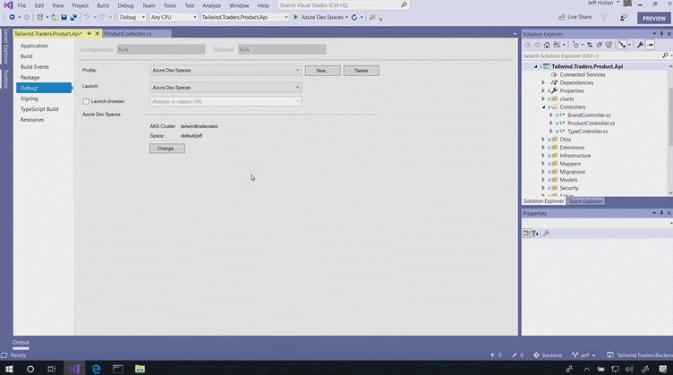

1. Here you are specifying that you want to develop in your Dev Space called Jeff. It is going to power the cloud to give you all the context of Kubernetes so everything just works.

    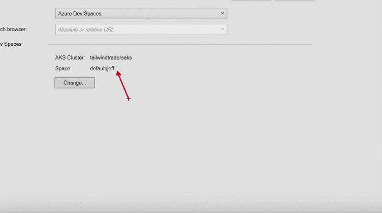

1. When you want to debug this after setting a breakpoint, all you have to do is push **Run (Azure Dev Spaces)**. Visual Studio syncs your code to the cloud, using the cloud to power this debugging experience so you can step through the code.

    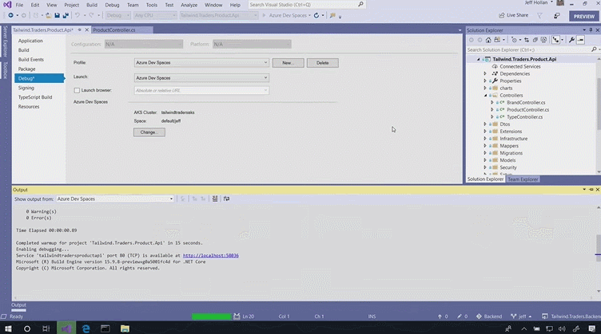

1. Navigate to your Azure Dev Space website. Notice that you are not setting a breakpoint on your production website. This is your own Dev Space. This is your own copy of the website powered by the cloud connected to Kubernetes. In fact, another great feature of Dev Spaces is if you want to have a Team Dev Space or a Feature Dev Space you can share these and collaborate with your team so that you get a rich and rapid inner loop development. To see if you can hit this bug, **Refresh** this page.

    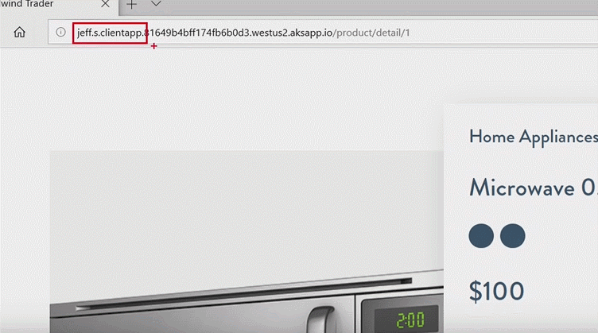

1. Switch to Visual Studio session. And here, you hit the breakpoint. The call to the service worked. You got the response back and you can actually come right in here and see what happened. And actually, by doing this you can eyeball the bug. You see here that there is this value property that is getting returned. This is not expected in this object cast. So, you just need to parse that value first, before you get the in-stock information.

    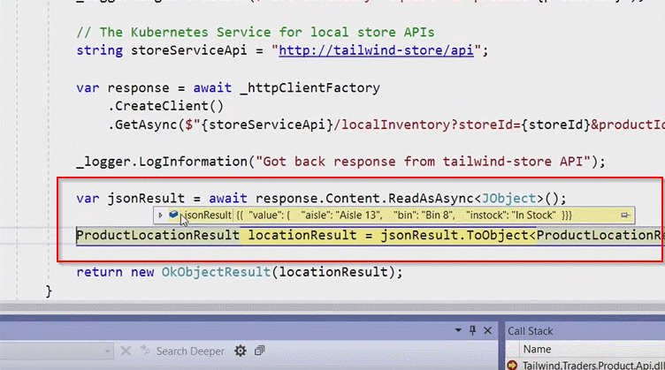

1. Stop the Debugger and remove the breakpoint. Fix the code by typing ***[“value”]*** after ***jsonResult*** as shown below. **Save** and click **Run**. To test this change you don't have to fiddle with containers. You are not going publish anything to a Container Registry or do a Kubernetes deploy. All you had to do was push run just like you are used to doing for every other application.

    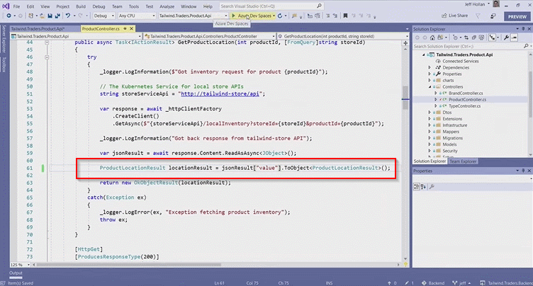

1. Switch to your Dev Space website. **Refresh** this page and now you see that that code change was, in fact, the fix to the bug. Now you can see the item is in stock where you can pick it up in the store. You could go back into the Visual Studio and check this code fix in and let it roll out into your production cluster. This has made me very productive as a developer.

    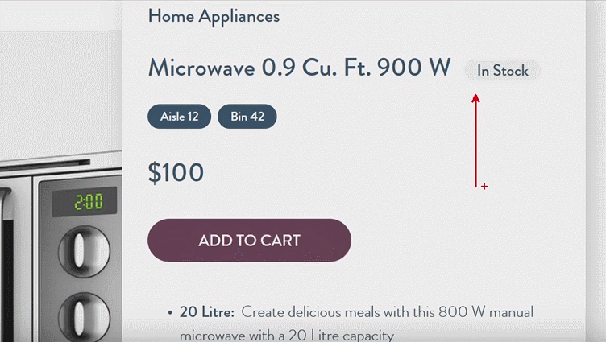

## Walkthrough: Virtual Nodes

 1. In the **Azure portal**, go to your **AKS cluster** and click on the **Scale** tab. In AKS, you can easily control the scale of Kubernetes cluster. You can see how many cores, memory is consumed. But if you think of an event like Black Friday this number can actually be extremely daunting. If you set this number too high you are going be paying for resources that you are not using. But if you set it too low your website is going to get overwhelmed and you are going to lose sales.

    

1. Click **Enabled** under Virtual Nodes. This one-of-a-kind feature in AKS called Virtual Nodes is going to spin up serverless containers when your Kubernetes cluster needs more resources. This gives your Kubernetes cluster almost instant and unlimited scale in just a few seconds.

    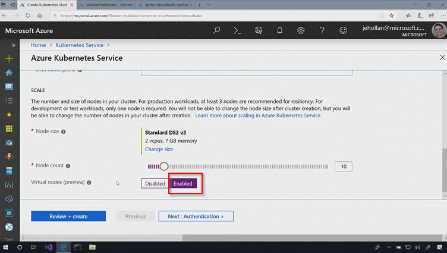

1. Optionally, to know more about the Virtual Node feature you can run a load test (if you have one handy) which is going to push a massive load on the website. While load test is in progress you can go to your Resource Group and filter based on Container instances to see that Kubernetes would be creating serverless containers for you. And when the traffic slows down these are going to be de-provisioned. So you only pay for that burst traffic when you need it.
   

## Summary

Azure makes development teams working with microservices and Kubernetes more efficient by combining the capabilities of Visual Studio and AKS Dev Spaces. Operations team become more reliable by using powerful services like Virtual Nodes to spin up instant serverless containers when you need it the most.